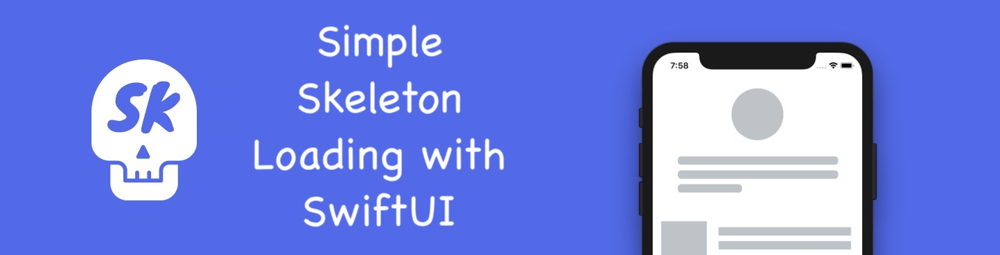

<p align="center">
  • <a href="#-usage">Usage</a>
  • <a href="#-features">Features</a>
  • <a href="#-supported platforms">Supported Platforms</a>
</p>

Skeleton screens, when used to indicate that a screen is loading, are perceived to be of a shorter duration compared to other loading animations. Skeleton displays that take advantage of slow, steady movements that move left to right are seen as shorter. This is a ligthweight example that leverage Apple's native SwiftUI `redacted` view modifier and adds a shimmering animation over redacted views.
Also it uses SwiftUI transitional animation to gradually morph from loading placeholder to the loaded content.

# Demo :skull:


# Usage :rocket:

```swift
/// Shows the usage of `skeleton` View Modifier together with the `redacted` Modifier
/// `skeletonCard` is the view where we want to show the loading is in progress 
struct SkeletonPreview: View {
    @State var isLoading: Bool? = true/// may be @Binding too, or may be a ViewModel/Environment flag 
    
    var body: some View {
        ///...
        if isLoading ?? false {
            skeletonCard /// apply `skeleton` in conjunction with `redacted`
            .redacted(reason: isLoading ?? false ? .placeholder : [])
            .skeleton($isLoading)
        } else {
            skeletonCard /// loading is done, show the real/unredacted content
        }
    }
}
```
# Features :sparkles:
Ligthweight, coulde be used by copy and paste the code snippet below into a project

```swift
import SwiftUI

struct Skeleton: ViewModifier {
    @Binding private var isLoading: Bool?
    @State private var isAnimating: Bool = false
    // gradient animation params
    private let min = -0.5
    private let max = 1.5
    private let animation = Animation.linear(duration: 1.5).repeatForever(autoreverses: false)
    private let gradient = Gradient(colors: [.gray, .white.opacity(0.5), .gray])
    private let angle = Angle.degrees(0.0)
    
    init(isLoading: Binding<Bool?>){
        self._isLoading = isLoading
    }
    
    func body(content: Content) -> some View {
        if isLoading ?? false {
            content
            .overlay {
                ///Apply skeleton animation
                    shimmer
            }
            .mask(alignment: .center) {
                ///Apply content mask, so the content shapes (Image, Text, etc) will be skeletonized
                ///The content shapes are provided by the `redacted` view modifier
                ///If we don't apply content mask, the whole content recangle will be skeletonized
                    content
            }
        } else {
            content
        }
    }
    
    var startPoint: UnitPoint {
        isAnimating ? UnitPoint(x: 1, y: 1) : UnitPoint(x: min, y: min)
    }
    var endPoint: UnitPoint {
        isAnimating ? UnitPoint(x: max, y: max) : UnitPoint(x: 0, y: 0)
    }
    
    var shimmer: some View {
        LinearGradient(
            gradient: self.gradient,
            startPoint: startPoint,
            endPoint: endPoint
        )
        .rotationEffect(angle)
        .scaleEffect(1.5)
        .clipped()
        .animation(animation, value: isAnimating)
        .onAppear {
            guard isLoading ?? false else {return}
            isAnimating = true
        }
        .onChange(of: isLoading, perform: { value in
            isAnimating.toggle()
        })
    }
}

public extension View {
    func skeleton(_ isLoading: Binding<Bool?>) -> some View {
        self.modifier(Skeleton(isLoading: isLoading))
    }
}
```

# Supported Platforms :iphone:
- iOS 15.0 

